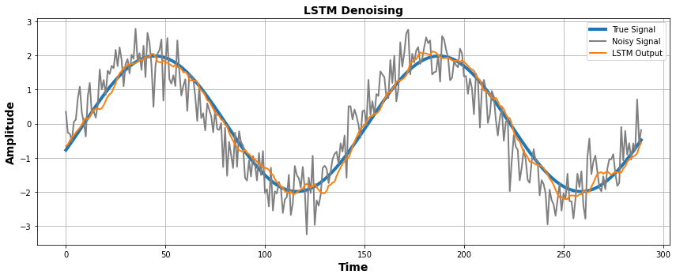

# LSTM for Signal Denoising

This project demonstrates how a Long Short-Term Memory (LSTM) neural network can denoise a noisy sine wave by learning to reconstruct the original clean signal.

---

## Overview

We generate a clean sine wave signal, add white Gaussian noise, and train an LSTM model to recover the original signal. This is a practical example of using deep learning for signal processing and time-series denoising.

---

## What is LSTM and Why Use It?

**LSTM (Long Short-Term Memory)** is a specialized type of recurrent neural network (RNN) that is excellent for learning from **sequential data**, especially when long-term dependencies matter.

It’s particularly powerful for **denoising signals** like EEG, ECG, and audio, because:
- It can **retain memory of past samples**
- Learns **temporal patterns**
- Suppresses noise using **nonlinear learning** (vs. traditional LMS/RLS filters which are linear)

---

## LSTM Internals: Gate-Based Memory

Each LSTM unit has **gates** that control what information should be remembered, forgotten, or output at each time step.

### LSTM Equations:

1. **Forget Gate**  
   `f_t = sigmoid(W_f · [h_{t-1}, x_t] + b_f)`

2. **Input Gate**  
   `i_t = sigmoid(W_i · [h_{t-1}, x_t] + b_i)`

3. **Candidate Cell State**  
   `ĉ_t = tanh(W_c · [h_{t-1}, x_t] + b_c)`

4. **Update Cell State**  
   `c_t = f_t * c_{t-1} + i_t * ĉ_t`

5. **Output Gate**  
   `o_t = sigmoid(W_o · [h_{t-1}, x_t] + b_o)`

6. **Hidden Output**  
   `h_t = o_t * tanh(c_t)`

---

## Project Structure

- `lstm_denoising.py`: Main script with signal generation, LSTM model, training, and plotting.
- `LSTM_Denoising_Output.png`: Plot comparing true signal, noisy input, and LSTM output.

---

## Experiment Settings

- Generate a synthetic sine wave as the **true signal**
- Add Gaussian noise to simulate a **noisy observation**
- Normalize the data using `MinMaxScaler`
- Use a **sliding window** to extract sequences as LSTM input
- Train an LSTM network to **predict the denoised signal**
- Evaluate performance using **Mean Squared Error (MSE)**
- Plot the clean, noisy, and LSTM-denoised output for comparison

| Parameter         | Value                         |
|------------------|-------------------------------|
| Signal           | \( 2\sin(t) \), 1000 samples  |
| Noise            | Gaussian (mean=0, std=0.5)     |
| LSTM Units       | 32                             |
| Optimizer        | Adam                           |
| Loss             | Mean Squared Error             |
| Train/Test Split | 70% / 30%                      |

---

## Results

| Metric     | Value (Approx) |
|------------|----------------|
| Test MSE   | ~0.020         |

✅ The model effectively reconstructs the clean sine wave, removing most of the Gaussian noise.

---

## Visualization



---

## Requirements

```bash
pip install numpy matplotlib scikit-learn tensorflow
